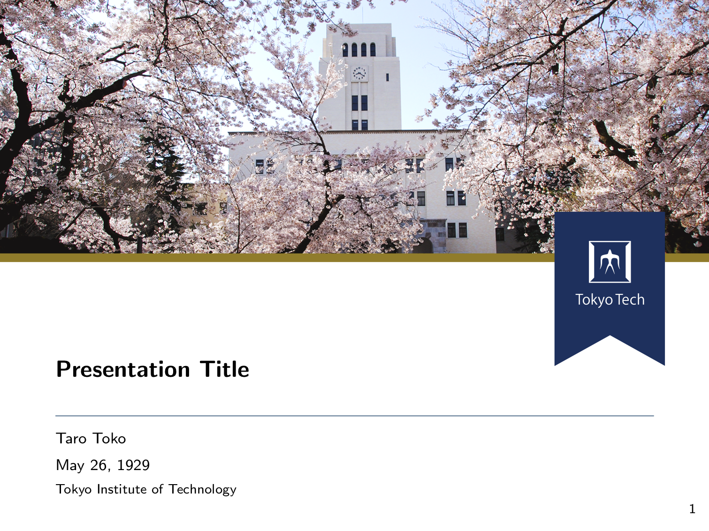
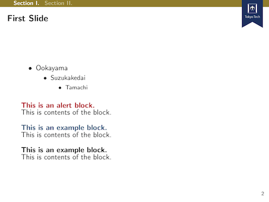

# Tokyo Tech-flavored Metropolis Theme


The cover photo and the Tokyo Tech seals belong to Tokyo Institute of Technology.

**Tokyo Tech-flavored Metropolis Theme** is a Beamer theme that imitates [Tokyo Tech's PowerPoint template](https://www.titech.ac.jp/staff/rules/logo/file/ppt_en.pptx).
This theme is based on [Metropolis](https://github.com/matze/mtheme) theme.

# How to Use This Theme
Place this directory to appropriate custom package directory and put `\usetheme{titech}` to your Beamer slides.
The `noimg` option prevents the theme from using official iamges, which are **not** included in this repository (see the following section for details).

# How to Embed The Tokyo Tech's Logo and The Cover Photo
This theme does not contain the Tokyo Tech's logo and the cover photo due to a copyright problem.
You can optionally extract the images from the official PowerPoint template and embed them to your Beamer slides by executing

```
cd /path/to/this/repository
wget https://www.titech.ac.jp/staff/rules/logo/file/ppt_en.pptx
./extract_ppt_images.sh
```
